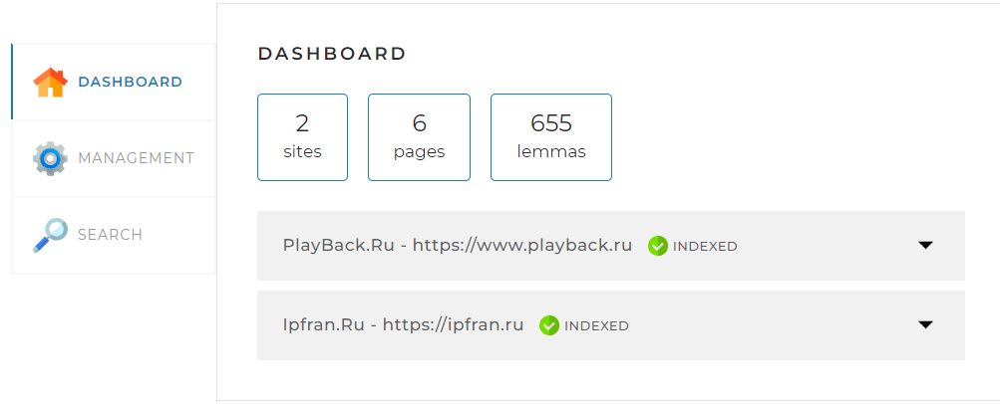

# Поисковая система

## Описание проекта

Приложение "Поисковая система" разработано для обхода указанных веб-сайтов,
индексации их контента и предоставления эффективных и релевантных результатов
поиска на основе пользовательских запросов.

## Стэк используемых технологий

- *Язык программирования*: Java
- *Фреймворк*: Spring Boot
- *Сборщик пакетов*: Maven
- *Веб-приложения*: Spring Boot Starter Web, Spring Boot Starter Thymeleaf 
- *База данных*: MySQL (через MySQL Connector)
- *ORM*: Spring Data JPA
- *Парсинг HTML*: Jsoup
- *Автоматическая генерация кода*: Lombok

## Инструкция по локальному запуску проекта

### Предварительные требования:

- Установленный JDK (рекомендуется JDK 11)
- Установленный Maven
- MySQL
- Git

### Шаги для запуска:

1. *Клонирование репозитория:*

sh

```
git clone https://github.com/DimTiabu/searchEngine.git
```

2. *Установка списка сайтов для индексации в файле [application.yaml](application.yaml).* Например:

```
indexing-settings:
sites:
- url: https://volochek.life/
name: volochek.life
- url: https://www.playback.ru
name: PlayBack.Ru
- url: https://ipfran.ru
name: Ipfran.Ru
```

3. *Установка логина и пароля для доступа к БД в файле [application.yaml](application.yaml).* Например:
  ```
spring:
    datasource:
    username: root
    password: testtest
```
4. *Переход в директорию репозитория:*

sh

```
cd searchEngine
```

5. *Сборка проекта:*

sh

```
mvn clean install
```

6. *Запуск приложения:*

sh

```
mvn spring-boot:run
```

### Создание базы данных для работы с приложением в MySQL:

1. *Создание БД search_engine_db (если она еще не существует) в MySQL:*

2. *Создание таблиц для работы с сущностями:*

```
-- Таблица для сущности SiteEntity
CREATE TABLE site (
id INT AUTO_INCREMENT PRIMARY KEY,
status ENUM('INDEXING', 'INDEXED', 'FAILED') NOT NULL,
status_time TIMESTAMP NOT NULL,
last_error TEXT,
url VARCHAR(255) NOT NULL,
name VARCHAR(255) NOT NULL
);

-- Таблица для сущности PageEntity
CREATE TABLE page (
id INT AUTO_INCREMENT PRIMARY KEY,
site_id INT NOT NULL,
path TEXT NOT NULL,
code INT NOT NULL,
content MEDIUMTEXT NOT NULL,
INDEX idx_page_path (path(50)),
FOREIGN KEY (site_id) REFERENCES site(id) ON DELETE CASCADE
);

-- Таблица для сущности LemmaEntity
CREATE TABLE lemma (
id INT AUTO_INCREMENT PRIMARY KEY,
site_id INT NOT NULL,
lemma VARCHAR(255) NOT NULL,
frequency INT NOT NULL,
FOREIGN KEY (site_id) REFERENCES site(id) ON DELETE CASCADE
);

-- Таблица для сущности IndexEntity
CREATE TABLE `index` (
id INT AUTO_INCREMENT PRIMARY KEY,
page_id INT NOT NULL,
lemma_id INT NOT NULL,
`rank` FLOAT NOT NULL,
FOREIGN KEY (page_id) REFERENCES page(id) ON DELETE CASCADE,
FOREIGN KEY (lemma_id) REFERENCES lemma(id) ON DELETE CASCADE
);
```

### Использование API

Приложение предоставляет REST API для взаимодействия
с функционалом поисковой системы.

Для начала работы с приложением откройте браузер
и перейдите по адресу: http://localhost:8080/.  
В открывшемся окне вы увидите три вкладки:


1. **Вкладка DASHBOARD:** 
   * Предоставление информации об индексированных сайтах, страницах и леммах


2. **Вкладка MANAGEMENT:** 
   * Запуск полной индексации сайтов, 
указанных в файле [application.yaml](application.yaml) 
   * Запуск индексации конкретной страницы
   * Остановка запущенной индексации


3. **Вкладка SEARCH**
   * Посик страниц по поисковому запросу по всем индексированным сайтам
   * Поиск страниц по поисковому запросу по конкретному сайту
     

---

Спасибо за использование приложения Поисковая система! Удачного поиска!
